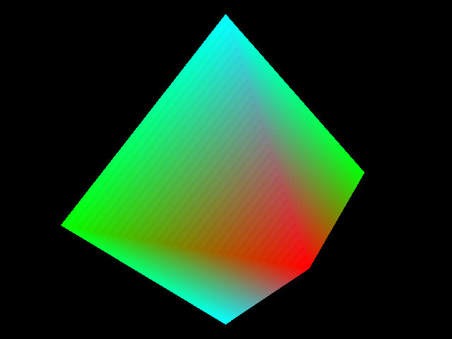



## DirectX Help

### Description

This is my VERY FIRST DirectX project. It draws a 3D diamond, then rotates it about the y-axis. Every line is commented, so I REALLY hope this helps somebody! Don't forget to vote!
 
### More Info
 

             |
---                |---
**Submitted On**   |2004-01-04 01:10:06
**By**             |[Wes Combs](https://github.com/Planet-Source-Code/PSCIndex/blob/master/ByAuthor/wes-combs.md)
**Level**          |Beginner
**User Rating**    |5.0 (10 globes from 2 users)
**Compatibility**  |VB 5\.0, VB 6\.0
**Category**       |[DirectX](https://github.com/Planet-Source-Code/PSCIndex/blob/master/ByCategory/directx__1-44.md)
**World**          |[Visual Basic](https://github.com/Planet-Source-Code/PSCIndex/blob/master/ByWorld/visual-basic.md)
**Archive File**   |[DirectX\_He169016142004\.zip](https://github.com/Planet-Source-Code/wes-combs-directx-help__1-50039/archive/master.zip)

